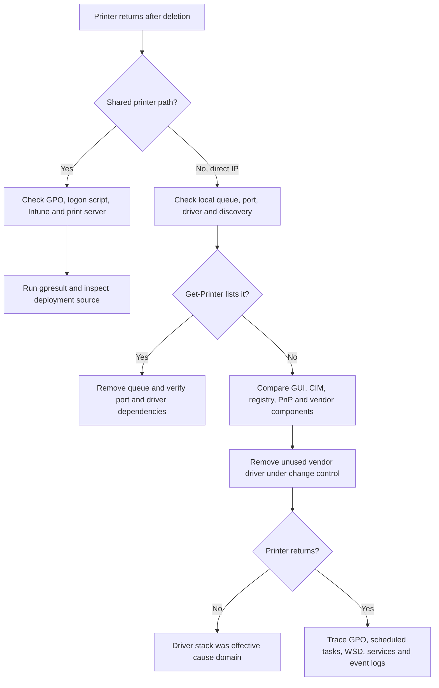

<a id="top"></a>

# Case Study 01 – Ghost Kyocera Printer Reappears After Deletion

> **Category:** Client-side printer queue, driver and device-enumeration issue  
> **Environment:** Windows domain-joined workstation, Kyocera printer, direct Standard TCP/IP installation  
> **Difficulty:** Intermediate  
> **Status:** Resolved  
> **Primary finding:** The locally installed Kyocera driver package was associated with the printer returning after the visible queue was removed.

---

## 1. Incident Summary

A Kyocera network printer was installed directly on a Windows workstation through a **Standard TCP/IP Port**. The computer was joined to Active Directory, but the printer was not connected through a shared print queue and was not intentionally deployed through Group Policy.

The user removed the printer from **Printers & scanners**, but the device returned within seconds. This initially looked like a Group Policy, logon script or domain printer-deployment problem. However, the printer could not be found with the normal PowerShell printer-enumeration commands even while it remained visible in the Windows graphical interface.

The decisive test was removing the associated Kyocera printer driver. After the driver was removed, the printer stopped returning.

This case demonstrates why a printer that reappears after deletion is **not automatically a GPO problem**. Windows may expose printer queues, Plug and Play device objects, driver packages, WSD-discovered devices and vendor-created components through different management interfaces.

---

## 2. Environment

| Component | Details |
|---|---|
| Client operating system | Windows 10 or Windows 11 domain-joined workstation |
| Directory services | Active Directory Domain Services |
| Printer vendor | Kyocera |
| Installation method | Direct IP installation |
| Port type | Standard TCP/IP Port |
| Print server | Not used |
| Shared queue | Not used |
| GPO deployment | Not identified during investigation |
| Primary driver family | Kyocera KX or another Kyocera model-specific package |

> [!NOTE]
> The exact model and driver version were not captured during the original incident. For future cases, record both before making changes.

---

## 3. Symptoms

The workstation showed the following behaviour:

- The Kyocera printer appeared under **Settings → Bluetooth & devices → Printers & scanners** or **Control Panel → Devices and Printers**.
- Deleting the printer appeared to succeed.
- The printer returned again after a short delay.
- The printer was installed directly by IP rather than through a UNC path such as `\\PRINT01\PrinterName`.
- The standard PowerShell query did not return the printer:

```powershell
Get-Printer
```

- The CIM query also did not identify the visible printer object:

```powershell
Get-CimInstance -ClassName Win32_Printer |
    Select-Object Name, SystemName, DriverName, PortName, Network, Local
```

- Removing only the visible printer did not solve the issue.
- Removing the Kyocera printer driver stopped the printer from appearing again.

---

## 4. Why the Symptoms Were Misleading

Because the computer was joined to Active Directory, the first suspicion was that the printer was being recreated by one of these mechanisms:

1. Group Policy Preferences.
2. A deployed printer connection from Print Management.
3. A user or computer logon script.
4. A scheduled task.
5. Microsoft Intune or another endpoint-management platform.
6. A roaming user-profile printer mapping.

Those are valid hypotheses whenever a printer returns after removal. However, the direct TCP/IP installation and the fact that removing the driver ended the behaviour shifted the investigation toward the local print subsystem and vendor driver package.

A Windows printer can involve several separate objects:

- Print queue.
- Printer driver.
- Driver package in the Driver Store.
- Printer port.
- Device instance visible to Plug and Play.
- WSD or network-discovery object.
- Vendor status monitor or discovery utility.
- User-profile printer settings.

Deleting one visible object does not necessarily remove all related components.

---

## 5. Investigation Workflow

### Step 1 – Confirm the Current User Context

Printer connections can be scoped per user or per computer. Running PowerShell as another administrator may produce a different view from the signed-in user.

```powershell
whoami
$env:COMPUTERNAME
```

Run initial checks in the affected user's normal session, then repeat elevated checks when required.

---

### Step 2 – Enumerate Windows Printer Queues

```powershell
Get-Printer |
    Sort-Object Name |
    Format-Table Name, Type, DriverName, PortName, Shared, Published -AutoSize
```

Expected result in this case: the Kyocera printer visible in the GUI was not returned.

Also query WMI/CIM:

```powershell
Get-CimInstance -ClassName Win32_Printer |
    Sort-Object Name |
    Format-Table Name, DriverName, PortName, Network, Local, Default -AutoSize
```

When both commands fail to show an item that remains visible in the GUI, consider that the interface may be displaying a device object, cached object or vendor-managed component rather than a healthy spooler queue.

---

### Step 3 – Check Whether the Printer Is Domain-Deployed

Generate a Resultant Set of Policy report:

```cmd
gpresult /h C:\Windows\Temp\Printer-GPResult.html /f
```

Review these areas:

```text
User Configuration
└── Preferences
    └── Control Panel Settings
        └── Printers

Computer Configuration
└── Preferences
    └── Control Panel Settings
        └── Printers
```

Also review:

```text
User Configuration
└── Windows Settings
    └── Scripts (Logon/Logoff)

Computer Configuration
└── Windows Settings
    └── Scripts (Startup/Shutdown)
```

A useful validation test is:

```cmd
gpupdate /force
```

If the printer returns immediately after policy processing, investigate GPO deployment further. In this case, the evidence did not identify a domain-based printer deployment.

---

### Step 4 – Confirm the Installation Type

A shared printer normally uses a UNC connection such as:

```text
\\PRINT01\ADL-FINANCE-MFP01
```

A direct printer normally uses a local queue and a port such as:

```text
IP_10.20.30.40
```

List ports:

```powershell
Get-PrinterPort |
    Sort-Object Name |
    Format-Table Name, Description, PrinterHostAddress, PortNumber, SNMPEnabled -AutoSize
```

The affected printer was confirmed as a direct IP installation, reducing the likelihood of print-server remapping.

---

### Step 5 – Check the Print Registry Carefully

Back up relevant keys before deleting anything:

```cmd
reg export "HKCU\Printers" "%USERPROFILE%\Desktop\HKCU-Printers-Backup.reg" /y
reg export "HKLM\SYSTEM\CurrentControlSet\Control\Print" "%USERPROFILE%\Desktop\HKLM-Print-Backup.reg" /y
```

Check per-user network connections:

```powershell
Get-ChildItem -Path 'HKCU:\Printers\Connections' -ErrorAction SilentlyContinue
```

Check local spooler queues:

```powershell
Get-ChildItem -Path 'HKLM:\SYSTEM\CurrentControlSet\Control\Print\Printers' \
    -ErrorAction SilentlyContinue |
    Select-Object PSChildName
```

Check user device mappings:

```powershell
Get-ItemProperty \
    -Path 'HKCU:\Software\Microsoft\Windows NT\CurrentVersion\Devices' \
    -ErrorAction SilentlyContinue

Get-ItemProperty \
    -Path 'HKCU:\Software\Microsoft\Windows NT\CurrentVersion\PrinterPorts' \
    -ErrorAction SilentlyContinue
```

Do not delete broad registry branches during initial troubleshooting. Remove only a confirmed stale entry and only after exporting the key.

---

### Step 6 – Inspect Printer Drivers

Open Print Management:

```cmd
printmanagement.msc
```

Navigate to:

```text
Print Servers
└── <LocalComputerName>
    └── Drivers
```

Alternatively, open Print Server Properties:

```cmd
printui.exe /s /t2
```

List installed printer drivers with PowerShell:

```powershell
Get-PrinterDriver |
    Sort-Object Manufacturer, Name |
    Format-Table Name, Manufacturer, MajorVersion, InfPath -AutoSize
```

Filter for Kyocera:

```powershell
Get-PrinterDriver |
    Where-Object {
        $_.Name -match 'Kyocera' -or $_.Manufacturer -match 'Kyocera'
    } |
    Format-List *
```

Inspect third-party Driver Store packages:

```cmd
pnputil /enum-drivers
```

A narrower search can help during an interactive review:

```cmd
pnputil /enum-drivers | findstr /i "kyocera oem"
```

> [!WARNING]
> Do not remove a Kyocera driver that is still used by another active printer queue. Record dependencies and obtain change approval where required.

---

### Step 7 – Check Vendor Utilities and Device Discovery

Review installed applications and services for Kyocera utilities, status monitors, device-discovery tools or old deployment packages.

```powershell
Get-Service |
    Where-Object {
        $_.DisplayName -match 'Kyocera|Printer|Print'
    } |
    Sort-Object DisplayName |
    Format-Table Status, Name, DisplayName -AutoSize
```

Also review:

```text
Task Manager → Startup apps
Task Scheduler → Task Scheduler Library
Settings → Apps → Installed apps
Device Manager → View → Show hidden devices
```

Potential locations in Device Manager include:

```text
Printers
Print queues
Software devices
Universal Serial Bus devices
```

The original case did not conclusively identify a separate Kyocera utility as the recreating component, so the root cause should not be overstated as a specific background service without logs or process-monitor evidence.

---

### Step 8 – Review PrintService Event Logs

Enable and review the operational print log:

```powershell
wevtutil sl 'Microsoft-Windows-PrintService/Operational' /e:true
```

Retrieve recent events:

```powershell
Get-WinEvent -LogName 'Microsoft-Windows-PrintService/Operational' \
    -MaxEvents 100 -ErrorAction SilentlyContinue |
    Select-Object TimeCreated, Id, LevelDisplayName, Message |
    Format-List
```

Also review the administrative log:

```powershell
Get-WinEvent -LogName 'Microsoft-Windows-PrintService/Admin' \
    -MaxEvents 50 -ErrorAction SilentlyContinue |
    Select-Object TimeCreated, Id, LevelDisplayName, Message |
    Format-List
```

For a future recurrence, capture events immediately before deleting the printer and until it returns. This provides stronger evidence about which component recreates or rediscovers it.

---

## 6. Root Cause Assessment

### Confirmed observations

- The printer was locally installed using direct TCP/IP.
- It was not intentionally connected through a Windows print server.
- Removing the visible printer did not stop it from returning.
- `Get-Printer` did not enumerate the object seen in the GUI.
- Removing the Kyocera driver stopped the printer from returning.

### Most likely cause

The remaining Kyocera driver package or an associated local print/device component allowed Windows or Kyocera software to recreate or rediscover the printer after the visible object was removed.

### Important qualification

The original troubleshooting evidence proves a strong association with the installed driver package, but it does **not** by itself prove which internal component performed the recreation. Possible mechanisms include:

- A stale or corrupted driver-backed device object.
- Vendor discovery or status-monitor software.
- Plug and Play re-enumeration.
- WSD or network discovery.
- A vendor port monitor.
- A mismatch between the Settings device view and the spooler queue database.

For that reason, the safest final wording is:

> The local Kyocera driver stack was the effective cause domain. Removing the driver package stopped the recurrence, while no AD, GPO or print-server deployment was identified.

---

## 7. Resolution Procedure

### Phase A – Record the Existing Configuration

Before removal, record:

```powershell
Get-Printer | Export-Clixml "$env:USERPROFILE\Desktop\Printers-Before.xml"
Get-PrinterPort | Export-Clixml "$env:USERPROFILE\Desktop\PrinterPorts-Before.xml"
Get-PrinterDriver | Export-Clixml "$env:USERPROFILE\Desktop\PrinterDrivers-Before.xml"
```

Capture:

- Printer name.
- IP address.
- Port name.
- Driver name and version.
- Duplexer and tray configuration.
- Default printing preferences.
- Department or business owner.

---

### Phase B – Remove the Visible Printer

Try the supported method first:

```powershell
Remove-Printer -Name 'KYOCERA PRINTER NAME' -ErrorAction Stop
```

If the queue cannot be enumerated, remove it through **Printers & scanners**, **Devices and Printers**, or Print Management.

For a known network-printer connection, the PrintUI command would be:

```cmd
rundll32 printui.dll,PrintUIEntry /dn /n "\\PRINTSERVER\PRINTER"
```

That UNC removal command is not normally appropriate for a direct TCP/IP queue unless the object is actually a shared connection.

---

### Phase C – Stop the Spooler Before Driver Removal

Check for active jobs and business impact first:

```powershell
Get-PrintJob -PrinterName 'KYOCERA PRINTER NAME' -ErrorAction SilentlyContinue
```

Then stop the service if approved:

```powershell
Stop-Service -Name Spooler -Force
```

Do not delete spool files unless there are confirmed stuck jobs and the impact is understood.

---

### Phase D – Remove the Unused Kyocera Driver

Preferred graphical method:

```text
Print Management
→ Print Servers
→ <ComputerName>
→ Drivers
→ Right-click the unused Kyocera driver
→ Remove Driver Package
```

Or:

```cmd
printui.exe /s /t2
```

If the package remains in the Windows Driver Store, identify the correct published name using:

```cmd
pnputil /enum-drivers
```

Then remove only the confirmed unused package:

```cmd
pnputil /delete-driver oem##.inf /uninstall
```

Use `/force` only under an approved remediation plan because it can affect devices still using that package.

---

### Phase E – Remove an Unused TCP/IP Port

After confirming no other queue uses the port:

```powershell
$portName = 'IP_10.20.30.40'

$portInUse = Get-Printer -ErrorAction SilentlyContinue |
    Where-Object PortName -eq $portName

if (-not $portInUse) {
    Remove-PrinterPort -Name $portName -ErrorAction Stop
}
```

Never remove a port that is used by another queue.

---

### Phase F – Restart the Spooler and Reboot if Needed

```powershell
Start-Service -Name Spooler
Get-Service -Name Spooler
```

Restart the workstation if driver files remain locked or the GUI still shows stale device metadata.

---

### Phase G – Validate the Fix

Confirm the printer does not return after:

1. Restarting the Print Spooler.
2. Refreshing **Printers & scanners**.
3. Signing out and back in.
4. Running `gpupdate /force`.
5. Restarting the workstation.
6. Waiting through the endpoint-management policy refresh window.

Run:

```powershell
Get-Printer
Get-CimInstance -ClassName Win32_Printer
Get-PrinterDriver | Where-Object Name -match 'Kyocera'
Get-PrinterPort | Where-Object Name -match 'IP_|WSD|Kyocera'
```

In the resolved case, the printer no longer returned after the Kyocera driver was removed.

---

## 8. Reinstallation Best Practice

If the printer is still required:

1. Obtain the approved driver from the organisation's software repository or Kyocera's official support channel.
2. Prefer a current, supported driver compatible with the exact Windows architecture and printer model.
3. Avoid installing unnecessary discovery, status-monitor or fleet-management components on endpoints unless they are required.
4. Use a Standard TCP/IP Port with a fixed or reserved printer IP.
5. Record the driver version in the change ticket.
6. Print a Windows test page.
7. Validate duplex, colour, paper trays, finishing and secure-print features.
8. Monitor PrintService logs after installation.

Example installation pattern:

```powershell
$printerName = 'ADL-FIN-KYOCERA01'
$printerIp   = '10.20.30.40'
$portName    = "IP_$printerIp"
$driverName  = 'Kyocera TASKalfa xxxx KX'

if (-not (Get-PrinterPort -Name $portName -ErrorAction SilentlyContinue)) {
    Add-PrinterPort -Name $portName -PrinterHostAddress $printerIp
}

Add-Printer \
    -Name $printerName \
    -DriverName $driverName \
    -PortName $portName
```

Replace the example driver name with the exact installed driver name returned by `Get-PrinterDriver`.

---

## 9. Why `Get-Printer` May Not Show a Printer Visible in the GUI

`Get-Printer` queries the Windows print subsystem for printer queues. The modern Settings interface and classic Devices and Printers interface can also display devices discovered or registered through other Windows mechanisms.

Possible explanations include:

- The item is a Plug and Play device object rather than a valid spooler queue.
- The queue is partially deleted or corrupt.
- The UI is showing cached device metadata.
- The item was discovered through WSD.
- The current PowerShell session is running under a different user context.
- A vendor application exposes or recreates the device.
- The spooler provider and Settings device-enumeration provider have not synchronised.

This discrepancy is a diagnostic clue. It means troubleshooting should expand beyond `Get-Printer` rather than repeatedly running the same command.

---

## 10. Troubleshooting Decision Tree



---

## 11. Evidence Checklist for Future Incidents

Collect this evidence before remediation:

```powershell
$folder = Join-Path $env:USERPROFILE 'Desktop\Printer-Evidence'
New-Item -ItemType Directory -Path $folder -Force | Out-Null

Get-Date | Out-File "$folder\Timestamp.txt"
whoami | Out-File "$folder\UserContext.txt"
gpresult /h "$folder\GPResult.html" /f
Get-Printer | Format-List * | Out-File "$folder\Get-Printer.txt"
Get-CimInstance Win32_Printer | Format-List * | Out-File "$folder\Win32-Printer.txt"
Get-PrinterPort | Format-List * | Out-File "$folder\PrinterPorts.txt"
Get-PrinterDriver | Format-List * | Out-File "$folder\PrinterDrivers.txt"
Get-Service Spooler | Format-List * | Out-File "$folder\Spooler-Service.txt"

Get-WinEvent -LogName 'Microsoft-Windows-PrintService/Operational' \
    -MaxEvents 200 -ErrorAction SilentlyContinue |
    Export-Csv "$folder\PrintService-Operational.csv" -NoTypeInformation
```

Also capture screenshots showing:

- The printer before deletion.
- The printer immediately after deletion.
- The printer after it returns.
- Driver details.
- Port details.
- Installed Kyocera software.

---

## 12. Preventive Actions

- Standardise approved Kyocera driver versions.
- Avoid mixing multiple legacy KX driver packages on the same client.
- Prefer centrally managed print queues where appropriate.
- Disable or omit vendor discovery tools that are not operationally required.
- Use DHCP reservations or documented static IP addresses for printers.
- Maintain an inventory of queue, port, driver, model and IP relationships.
- Test driver upgrades with a pilot group before broad deployment.
- Use driver isolation on print servers where supported.
- Record whether each printer is deployed by GPO, Intune, script, print server or direct IP.
- Enable PrintService Operational logging during investigations.

---

## 13. Lessons Learned

1. **Domain membership does not prove GPO deployment.** A local printer problem can occur on a domain-joined endpoint.
2. **The Windows GUI and PowerShell may display different object types.** A device visible in Settings may not be a healthy print queue.
3. **Deleting a printer is not the same as removing its driver package.** Queues, ports, drivers and device objects have separate lifecycles.
4. **Removing the driver was the decisive test.** The recurrence stopped only after the Kyocera driver was removed.
5. **Root-cause language should match the evidence.** The driver stack was implicated, but the precise recreating process was not captured.
6. **Collect evidence before destructive changes.** Driver removal can affect other printers and should be controlled.
7. **Validate after policy refresh and reboot.** A quick GUI refresh alone is not enough to declare success.

---

## 14. Recommended Ticket Closure Notes

```text
Issue:
Kyocera direct-IP printer repeatedly reappeared after deletion on a domain-joined Windows workstation.

Investigation:
Confirmed the printer was not intentionally installed from a shared print server. Standard Get-Printer and Win32_Printer queries did not enumerate the object visible in Windows Printers & scanners. Removing the visible printer alone did not resolve the issue.

Root cause:
The local Kyocera driver stack was identified as the effective cause domain. No AD/GPO or print-server deployment source was identified during the investigation.

Resolution:
Removed the unused Kyocera printer driver package, restarted the Print Spooler and validated the result after refresh/sign-in/restart checks. The printer did not return.

Preventive action:
Use an approved current Kyocera driver, document direct-IP installations and avoid unnecessary vendor discovery components.
```

---

## 15. Related Repository Guides

- [Deploy Printers with Group Policy](../docs/04-deploy-printers-with-gpo.md)
- [Remove, Replace and Migrate Printers](../docs/05-remove-replace-migrate-printers.md)
- [Network Printer Troubleshooting](../docs/06-network-printer-troubleshooting.md)
- [Spooler, Queue and Driver Issues](../docs/07-spooler-driver-and-queue-issues.md)
- [PowerShell Administration](../docs/09-powershell-administration.md)
- [Helpdesk Incident Runbook](../docs/11-helpdesk-runbook.md)

---

<div align="center">

[🏠 Back to Repository Home](../README.md) · [⬆ Back to Top](#top)

**#ToanNguyenITOz**

</div>
