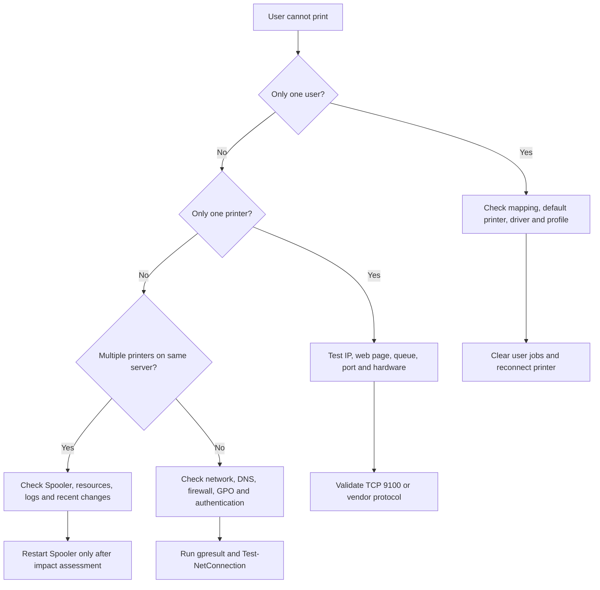

<a id="top"></a>

<div align="center">


# 🖨️ Active Directory Printer Administration & Troubleshooting

### *Enterprise printer deployment, administration, automation and incident resolution*

[](docs/02-build-a-print-server.md)
[](docs/01-printing-architecture.md)
[](docs/09-powershell-administration.md)

[](LICENSE)


[🚀 Quick Start](#-quick-start) • [📚 Documentation](#-documentation-library) • [⚙️ Scripts](#️-powershell-toolkit) • [🧰 Runbook](docs/11-helpdesk-runbook.md) • [🤝 Contributing](CONTRIBUTING.md)

</div>

---

> [!IMPORTANT]
> This repository is designed for **IT Support**, **Service Desk**, **Desktop Support**, **System Administrators**, and Windows Server lab environments managing network printers through **Active Directory, Group Policy, Print Management and PowerShell**.

A practical field guide and PowerShell toolkit for managing printers in an Active Directory environment.

This repository covers the complete printer lifecycle:

- Install and configure print servers.
- Add TCP/IP ports, drivers, print queues and shared printers.
- Publish printers in Active Directory.
- Deploy printers with Group Policy.
- Add or remove printers from user computers.
- Migrate queues between print servers.
- Troubleshoot network printing, spooler, driver, GPO, permissions and Point and Print issues.
- Collect evidence for escalation.
- Audit printer inventory and stale queues with PowerShell.

## 🗂️ Repository Structure

```text
active-directory-printer-troubleshooting/
├── README.md
├── CONTRIBUTING.md
├── docs/                  # 11 detailed administration guides
├── scripts/               # 11 PowerShell utilities
├── templates/             # Change, incident and inventory templates
└── images/                # Repository branding
```

## 🧭 Fast Troubleshooting Flow



## 🚀 Quick Start

```powershell
# Clone the repository
git clone https://github.com/toannguyenitoz/active-directory-printer-troubleshooting.git
cd active-directory-printer-troubleshooting

# Review printer server health
.\scripts\Invoke-PrintServerHealthCheck.ps1 -ComputerName PRINT01

# Test a physical network printer
.\scripts\Test-NetworkPrinter.ps1 -IPAddress 10.20.30.40

# Preview creation of an AD-published shared queue
.\scripts\Add-TcpIpPrinter.ps1 `
  -PrinterName "ADL-L2-MFP01" `
  -IPAddress "10.20.30.40" `
  -DriverName "Universal Printing PCL 6" `
  -PublishInAD `
  -WhatIf
```

> [!CAUTION]
> Run destructive or service-impacting scripts with **`-WhatIf`** first. Review active jobs and business impact before restarting the Print Spooler or deleting queues, ports, drivers or spool files.

## 📚 Documentation Library

| # | Guide | What You Will Learn |
|---:|---|---|
| 01 | [🏗️ Printing Architecture](docs/01-printing-architecture.md) | Clients, queues, ports, drivers, spooler, AD and GPO data flow |
| 02 | [🖥️ Build a Print Server](docs/02-build-a-print-server.md) | Install the role, validate services and enable event logging |
| 03 | [➕ Add, Share and Publish](docs/03-add-share-publish-printers.md) | Create ports and queues, share printers and publish to AD |
| 04 | [📦 Deploy with Group Policy](docs/04-deploy-printers-with-gpo.md) | User/computer deployment, targeting, removal and gpresult |
| 05 | [🔄 Remove, Replace and Migrate](docs/05-remove-replace-migrate-printers.md) | Safe retirement, replacement and print server migration |
| 06 | [🌐 Network Troubleshooting](docs/06-network-printer-troubleshooting.md) | IP, DNS, VLAN, firewall, RAW 9100 and connectivity faults |
| 07 | [🧯 Spooler, Queue and Driver Issues](docs/07-spooler-driver-and-queue-issues.md) | Stuck jobs, spooler crashes, driver isolation and logs |
| 08 | [🔐 Permissions and Point and Print](docs/08-permissions-security-and-point-and-print.md) | Queue ACLs, AD groups, driver restrictions and hardening |
| 09 | [⚡ PowerShell Administration](docs/09-powershell-administration.md) | Inventory, bulk changes, remote administration and testing |
| 10 | [🧪 Real-World Scenarios](docs/10-real-world-scenarios.md) | Seven practical enterprise troubleshooting scenarios |
| 11 | [🎧 Helpdesk Incident Runbook](docs/11-helpdesk-runbook.md) | Triage, evidence collection, escalation and closure notes |

## ⚙️ PowerShell Toolkit

See the complete [Scripts Catalogue](scripts/README.md).

| Script | Purpose |
|---|---|
| `Add-TcpIpPrinter.ps1` | Create a TCP/IP port and printer queue safely |
| `Remove-PrinterSafely.ps1` | Remove queues and optionally unused ports |
| `Repair-ClientPrinter.ps1` | Repair a client-side shared printer connection |
| `Reset-PrintSpooler.ps1` | Reset the Print Spooler with explicit safeguards |
| `Test-NetworkPrinter.ps1` | Test ping, TCP 9100 and printer reachability |
| `Get-PrinterInventory.ps1` | Export printer, port and driver inventory |
| `Find-StalePrinterQueues.ps1` | Identify unreachable or obsolete queues |
| `Get-PrinterEventLogs.ps1` | Collect relevant PrintService events |
| `Invoke-PrintServerHealthCheck.ps1` | Run consolidated print server health checks |
| `Export-PrintServerConfig.ps1` | Back up print server configuration |
| `Import-PrintServerConfig.ps1` | Restore or migrate exported configuration |

## 🏷️ Recommended Naming Standard

```text
<SITE>-<FLOOR_OR_AREA>-<TYPE><NUMBER>
```

Examples: `ADL-L2-MFP01`, `ADL-RECEPTION-PRN01`, `MEL-WH-LABEL02`.

## 🗂️ Operational Templates

- [📝 Printer Change Request](templates/printer-change-request.md)
- [🎫 Troubleshooting Ticket Template](templates/troubleshooting-ticket-template.md)
- [📊 Printer Inventory CSV](templates/printer-inventory.csv)

## 🛡️ Supported Approach

This project favours **least privilege**, **signed vendor-supported drivers**, **approved Point and Print servers**, **change control**, **evidence collection before destructive actions**, and **repeatable PowerShell automation**.

## 📄 License

Released under the [MIT License](LICENSE).

---

<div align="center">

### 👨‍💻 Author

**Xuan Toan Nguyen**  
*IT Support • Systems Administration • Microsoft 365 • Windows Server*  
📍 Adelaide, South Australia

[](https://www.linkedin.com/in/toan-nguyen-it-oz)
[](https://github.com/toannguyenitoz)

⭐ **Found this repository useful? Give it a star and share it with other IT professionals.**

[⬆ Back to Top](#top)

<sub>Made with ❤️ for the IT Support and Windows Administration community.</sub>

**#ToanNguyenITOz**

</div>
