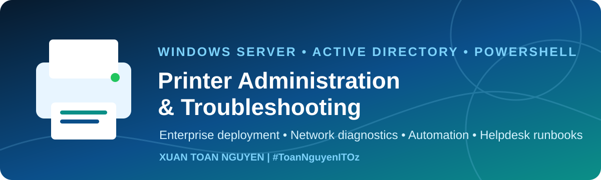

<a id="top"></a>

<div align="center">

[](../README.md)

# 🔄 05. Remove, Replace and Migrate Printers

**Retire queues safely, replace devices without user disruption and migrate print servers.**

 

[🏠 Home](../README.md) • [📚 Documentation](README.md) • [⬅ Previous](04-deploy-printers-with-gpo.md) • [Next ➡](06-network-printer-troubleshooting.md)

</div>

---

## 🗑️ Safely Remove a Printer

1. Confirm the business owner and retirement date.
2. Identify GPOs, scripts, applications and users that reference the queue.
3. Export the current print server configuration and inventory.
4. Stop new deployment by changing the GPO item to **Delete**.
5. Allow policy to remove client connections.
6. Check and drain remaining jobs.
7. Unpublish the queue from Active Directory.
8. Remove the queue.
9. Remove the port only when no other queue uses it.
10. Remove the driver only after confirming no remaining queue depends on it.

```powershell
.\scripts\Remove-PrinterSafely.ps1 -PrinterName 'ADL-L2-MFP01' -RemoveUnusedPort -WhatIf
```

## 🖨️ Replace a Physical Device

The lowest-impact method is normally to retain the **queue name and share name**.

1. Configure the new device with a reserved IP.
2. Test network access and the web interface.
3. Install and validate the approved driver on a test queue.
4. Pause the production queue and drain active jobs.
5. Create the new port.
6. Update the production queue's port and driver.
7. Print from the server and representative clients.
8. Validate duplex, trays, colour and finishing options.
9. Keep rollback details for the old port and driver.

## 🚚 Migrate a Print Server

### Export

```powershell
.\scripts\Export-PrintServerConfig.ps1 -ComputerName PRINT01
```

### Import Preview

```powershell
.\scripts\Import-PrintServerConfig.ps1 `
  -BackupFile '.\PRINT01-20260729.printerExport' `
  -ComputerName PRINT02 `
  -WhatIf
```

### Migration Checklist

- Build and patch the destination server.
- Pre-stage approved drivers.
- Verify DNS, firewall and delegated permissions.
- Import queues, ports and settings.
- Compare old and new inventories.
- Test every critical printer and specialist function.
- Update GPO UNC paths or use a controlled DNS/name transition.
- Maintain rollback until user validation is complete.

## ⚠️ Common Migration Failures

- Driver architecture or package incompatibility.
- Duplicate port names with different IPs.
- Old share names still deployed by GPO.
- Missing printer security descriptors.
- Applications hard-coded to the old server name.
- Print processors or vendor monitors not installed.

> [!CAUTION]
> Never delete an old queue, port or driver simply because the new server appears to work. Complete business validation and the rollback period first.

---

<div align="center">

### 👨‍💻 Author
**Xuan Toan Nguyen** — *IT Support • Systems Administration • Windows Server*  
📍 Adelaide, South Australia

[](https://www.linkedin.com/in/toan-nguyen-it-oz) [](https://github.com/toannguyenitoz)

[⬆ Back to Top](#top) • [🏠 Repository Home](../README.md)  
**#ToanNguyenITOz**

</div>
